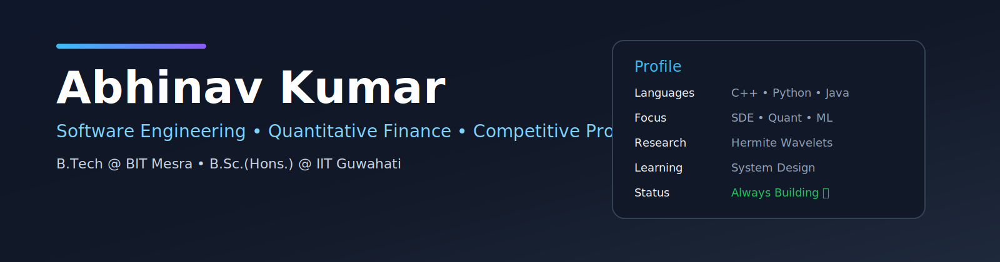

 

  

# 💻 Fastfetch

# 🚀 Competitive Programming

# ⚡ Tech Stack

# 📊 GitHub Analytics

  

# 📈 Contribution Graph

# 🏆 GitHub Trophies

# 📚 Research

> **Hermite Wavelet Solution of Singularly Perturbed Boundary Value Problems**

- Mathematical Modelling
- Python Implementation
- Publication in Progress

# 🐍 Contribution Snake

<picture>

<source
media="(prefers-color-scheme: dark)"
srcset="https://raw.githubusercontent.com/abhinavvv-hub/abhinavvv-hub/output/github-contribution-grid-snake-dark.svg">

</picture>

### Thanks for visiting!

